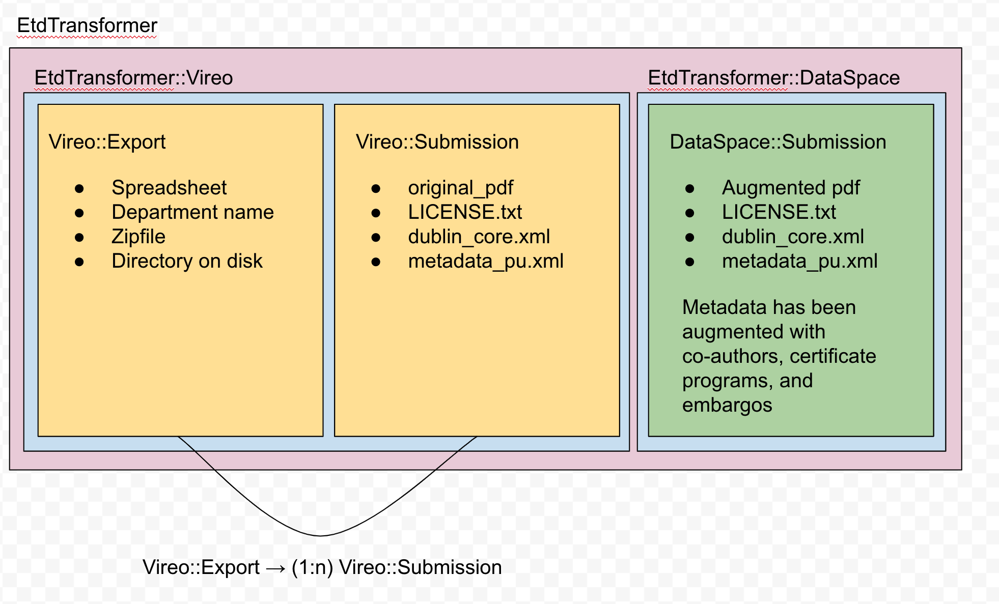

# vireo_transformation
Download theses from Vireo and transform them for Princeton long-term stewardship. It takes `VireoExport`s and turns them into `DspaceImport`s.

## Version
* Ruby 2.6.5

## Installation
1. git clone the repository
2. bundle install

## Running the tests
rspec spec

## Processing Vireo Exports
TBD: insert instructions here

## Object structure
1. `EtdTransformer` - A top level module to organize things
1. `EtdTransformer::Vireo` - A module for Vireo classes
1. `EtdTransformer::DataSpace` - A module for DataSpace classes
1. `EtdTransformer::Vireo::Submission` - A single thesis, with metadata, as received from Vireo
1. `EtdTransformer::DataSpace::Submission` - A single thesis, with augmented metadata, ready for submission to DataSpace

