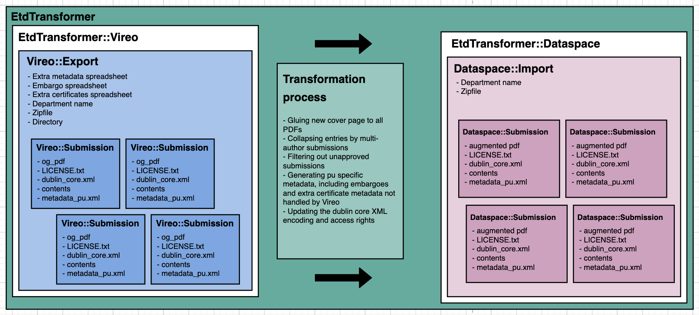

# etd_transformer
Transform theses for ingest into Princeton long-term data repository. This includes separate processes for:
* Dissertations
  * We get them from ProQuest and re-format them for DSpace ingest
  * [Process documentation is available in `docs`](https://github.com/pulibrary/etd_transformer/blob/main/docs/process-dissertations.md).
* Senior theses
  * We get these from ThesisCentral and augment them (e.g., with embargo metadata)
  * [Process documentation is available in `docs`](https://github.com/pulibrary/etd_transformer/blob/main/docs/process-theses.md). 

## Software Versions
* Ruby 2.6.5

## Pre-requisites
* ghostscript, for processing PDFs

## Installation
1. git clone the repository
2. bundle install

## Running the tests
rspec spec

## Object structure
1. `EtdTransformer` - A top level module to organize things
1. `EtdTransformer::DataSpace` - A module for DataSpace classes
  1. `EtdTransformer::DataSpace::Submission` - A single thesis, with augmented metadata, ready for submission to DataSpace
1. `EtdTransformer::Proquest` - A module for manipulating dissertation packages from ProQuest
  1. `EtdTransformer::Proquest::Dissertation` - A single dissertation, as delivered from Proquest
1. `EtdTransformer::Vireo` - A module for manipulating senior theses from Vireo (a.k.a ThesisCentral)
  1. `EtdTransformer::Vireo::Export` - A department's worth of theses, it also contains extra data needed to process theses, like a spreadsheet containing embargo dates.
  1. `EtdTransformer::Vireo::Submission` - A single thesis, with metadata, as received from Vireo

