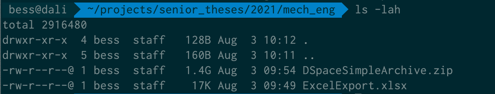
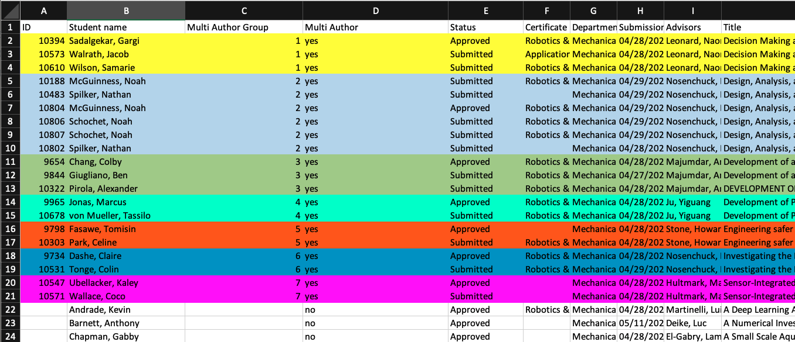

# How to process senior theses

## 1. Get the theses from Thesis Central / Vireo
1. Go to https://thesis-central.princeton.edu/admin/list
2. We process theses one department at a time. In Thesis Central, select Status == Approved, and choose a department.
3. Click "Download Export" and choose "Excel Export with Document URLs" as the export format. Save the file. 
4. Click "Download Export" again and this time choose "DSpace Simple Archive" as the export format. Note that for large departments you might need to try several times before it works.
5. You should now have a directory full of DSpace Simple Archive formatted export packages, and an Excel spreadsheet. Put the spreadsheet in the folder full of that department's theses.



## 2. Get the embargo data from sharepoint
Next, you'll need the spreadsheet that contains all of the embargo data. [Follow these instructions to export the data from sharepoint](https://docs.google.com/document/d/1CFCGR8ry29Xv55kPiJLoUmGxTZ5dzx2YaU83pJSLVcg/edit)
Note that sharepoint only allows spreadsheet downloads from a Windows PC, so plan ahead for this.

## 3. Run the process
1. Download the `etd_transformer` code and follow the installation instructions in the README. 
2. Invoke the script like this:

```
% thor help etd_transformer:cli:process_theses
Usage:
  thor etd_transformer:cli:process_theses

Options:
  [--input=INPUT]                              # Full path to input files
  [--output=OUTPUT]                            # Full path to output
  [--embargo-spreadsheet=EMBARGO_SPREADSHEET]  # Full path to embargo spreadsheet
  [--collection-handle=COLLECTION_HANDLE]      # The handle identifier of the DataSpace collection destination

% thor etd_transformer:cli:process_theses --input ~/projects/2021-theses-testing/economics --output ~/projects/2021-economics --embargo-spreadsheet ~/projects/2021-theses-testing/st_restrictions_5_25_21.xlsx  --collection-handle 88435/dsp013n203z151
Processing directory /Users/bess/projects/2021-theses-testing/economics.
Output will be written to /Users/bess/projects/2021-economics
Using embargo spreadsheet /Users/bess/projects/2021-theses-testing/st_restrictions_5_25_21.xlsx
DataSpace import collection will be 88435/dsp013n203z151
Finished processing 9508
Finished processing 9515
```

## 3a. Multi-author theses
IFF the department is Mechanical and Aerospace Engineering, theses might have more than one author per work. For this department, Lynn Durgin will provide an additional spreadsheet. She will group the theses such that each thesis is only accepted once, and all of the authors of a thesis are grouped together. Add a column to the `ExcelExport.xlsx` file called `Multi Author Group` and assign each grouping a unique-within-this-spreadsheet number. See attached screenshot. 



Then run this task using the grouped spreadsheet and the processed theses. This will augment the theses with the additional author metadata.

```
% thor etd_transformer:cli:multi_author --spreadsheet /path/to/ExcelExportGrouped.xlsx --directory /path/to/mech_eng_processed 
```

## 4. Upload to DSpace
Zip up the processed theses and upload them to the dataspace-dev server:

```
% cd /Users/bess/projects/2021-economics
% tar czvf economics.tar.gz economics
% scp economics.tar.gz dspace@gcp_dataspace_dev1:/home/dspace/dspace_imports/theses/2021
```

SSH to the Dataspace box, ensure the file is in the right place, and unzip it.

```
% ssh gcp_dataspace_dev1
pulsys@gcp-dataspace-dev1:~ $ sudo su dspace
dspace@gcp-dataspace-dev1:~ $ cd ~/dspace_imports/theses/2021
dspace@gcp-dataspace-dev1:~/dspace_imports/theses/2021 $ tar zxvf economics.tar.gz
```

Import the files into dataspace:

```
/dspace/bin/dspace import -add --eperson bs3097@princeton.edu --source $HOME/dspace_imports/theses/2021/economics --mapfile $HOME/dspace_imports/theses/2021/economics.mapfile --workflow
```
